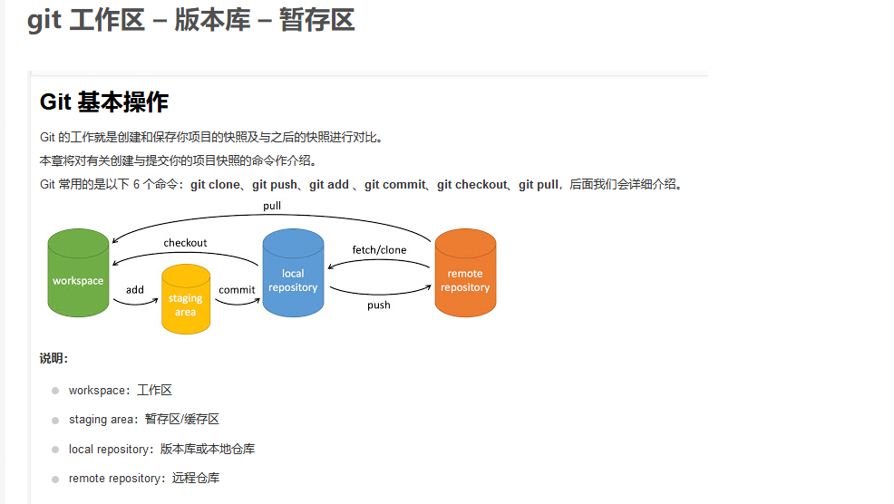
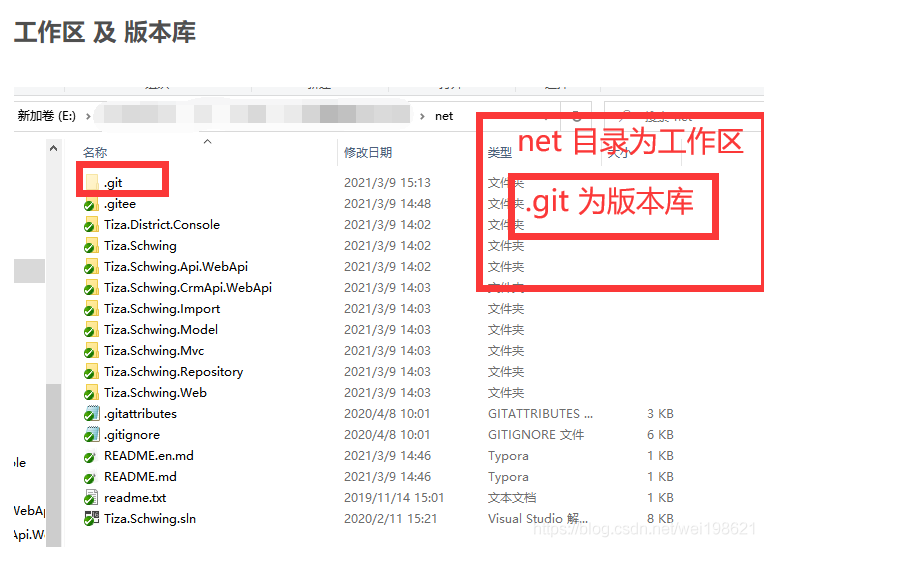
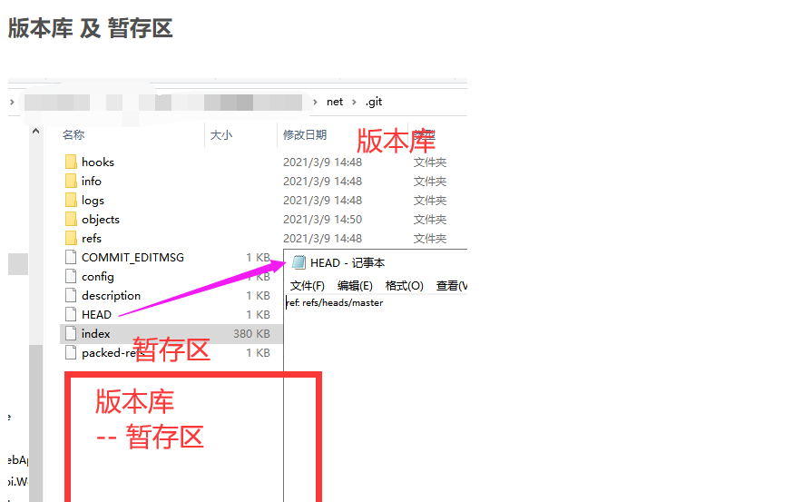
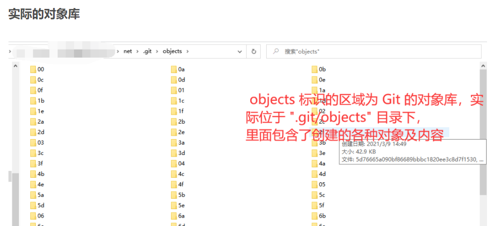
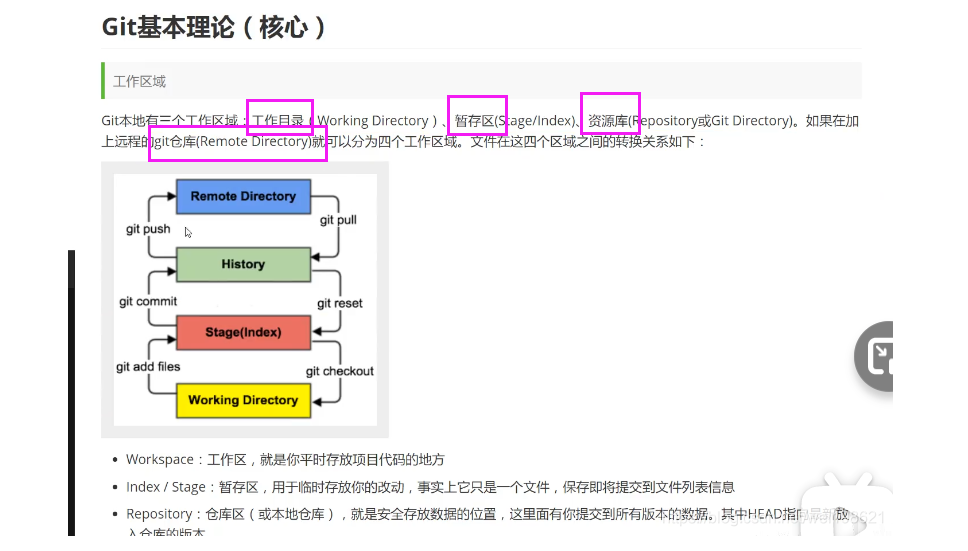
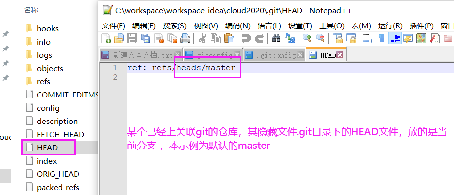
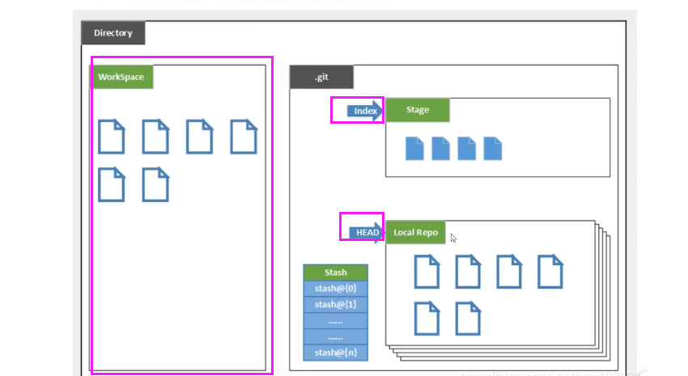
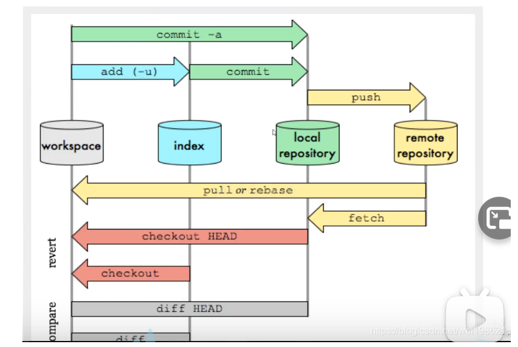
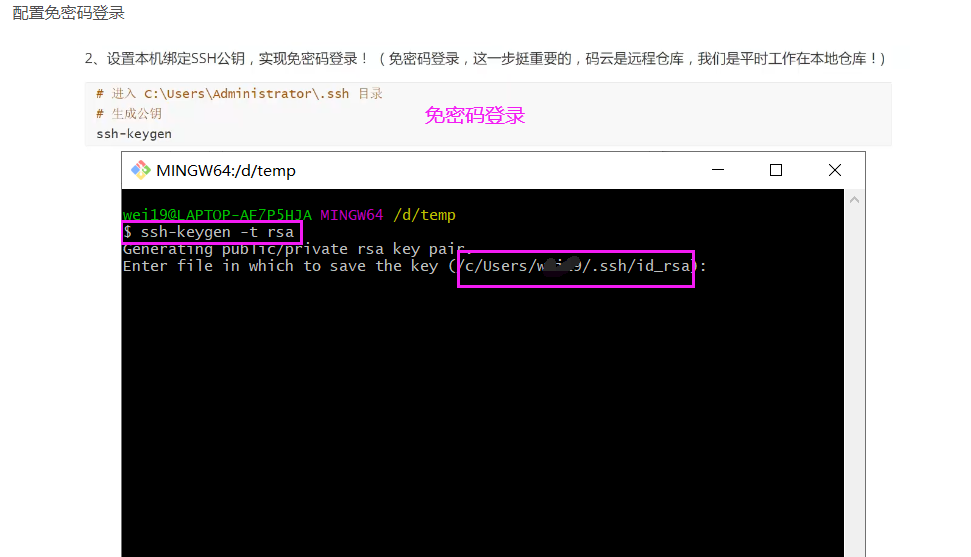
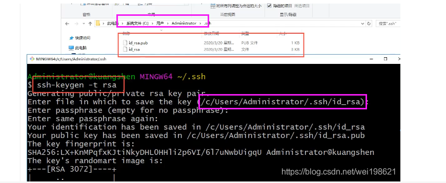

# Git


## Git认识











## Git配置

```shell
git config -l

git config --system --list  //系统

git config --global --list  //本地全局

git config --global user.name ""
git config --global user.email ""
```


## Git工作原理










## Git普通流程

```shell
git init

git add .

git commit -m ""

git remote add origin url

git push -u origin master

git clone url  //克隆远程仓库的文件

git reset HEAD <file>  //来取消暂存

```


## 配置SSH公钥及创建远程仓库






## Git分支

```shell
查看本地分支
git branch

远程分支
git branch -r

创建本地分支
git branch mybranch

切换分支
git checkout mybranch

创建并切换分支
git checkout -b mybranch

合并指定分支到当前分支
git merge mybranch

删除分支
git branch -d mybranch

删除远程分支
git push origin --delete mybranch
git branch -dr mybranch

分支的合并
git merge 
遇到冲突时的分支合并

本地仓库更换绑定的远程仓库

方法一 通过命令直接修改远程地址
进入git_test根目录
git remote 查看所有远程仓库， git remote xxx 查看指定远程仓库地址
git remote set-url origin http://192.168.100.235:9797/john/git_test.git
方法二 通过命令先删除再添加远程仓库
进入git_test根目录
git remote 查看所有远程仓库， git remote xxx 查看指定远程仓库地址
git remote rm origin
git remote add origin http://192.168.100.235:9797/john/git_test.git
方法三 直接修改配置文件
进入git_test/.git
vim config 

查看远程仓库

git remote

会显示需要读写远程仓库使用的 Git 保存的简写与其对应的 URL。
git remote -v

添加远程仓库
运行 git remote add <shortname> <url> 添加一个新的远程 Git 仓库

列出标签
git tag

创建标签并附注标签
git tag -a v1.4 -m "my version 1.4"

查看提交历史
git log


```

